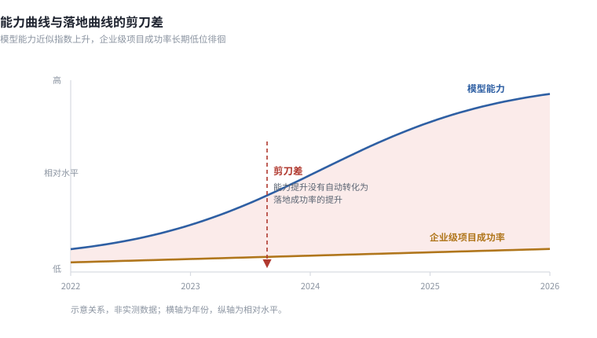
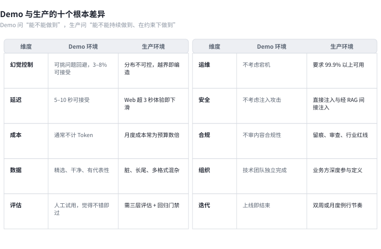
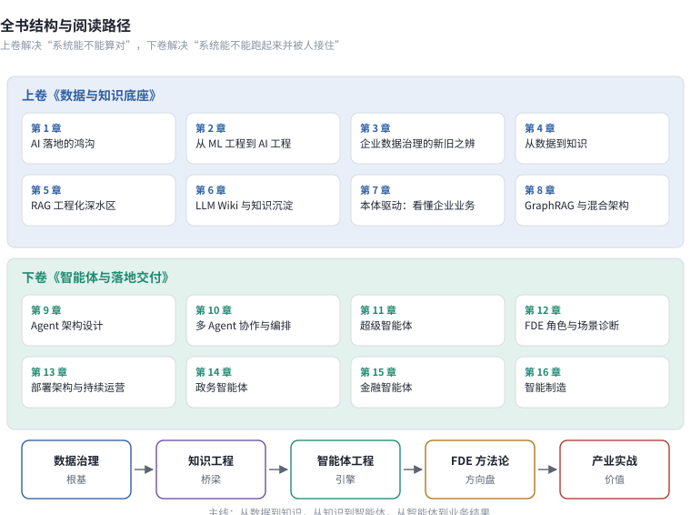

# 第 1 章　AI 落地的鸿沟

**本章速览卡**　［■主读］

| 项目 | 内容 |
|------|------|
| 解决什么问题 | 为什么模型能力年年刷榜，企业 AI 项目的成功率却几乎没动？钱和人才都投了，回报去了哪里？ |
| 读完得到什么 | ① 一张能力曲线与落地曲线的剪刀差图；② 三个可复用的失败场景解剖法；③ 一套区分 Demo 与生产的十个判据；④ 一张失败归因自查表；⑤ 把 Demo 与生产的差异写成可计算口径的方法（Pass@k／Pass^k）与护栏强度分层 |
| 前置章节 | 无。本章是全书起点 |
| 数据快照 | 2026-09 |

---

2026 年春天，一位省级电信运营商的技术负责人给我看了一份上线复盘。他们的智能客服在内部测试里做到了 93% 的回答准确率，评审会上一路通过。上线第一个月，投诉量涨了 47%。

问题出在一个具体的问题上。有用户问"怎么关闭国际漫游的自动续费"，系统给了一条不存在的菜单路径，一级一级写得很清楚，用户照着点，最后卡在第三步。这类回答一共出现了多少条，团队后来才知道——舆情系统里抓到的负面反馈，三分之一属于这个类型：不是答得不好，是答得笃定。

他们事后做了一件正确但迟到的事：把上线后两周的生产日志拉出来，按错误类型重新标注。结果让团队意外——在内部测试里几乎消失的"编造型回答"，在生产里占了错误总量将近三成。而测试集的 200 道题，是产品经理凭经验凑出来的"常见问题"，真实提问来自全省千万级用户，方言、错字、跨业务的长句都在里面。［D｜本书项目复盘，单一脱敏案例］

更麻烦的是成本结构。投诉涨了之后，原本指望被 AI 分流的人工客服坐席又涨了回来，排班工时回到上线前水平。也就是说，这个系统在上线后的一段日子里，既没省下人力，又额外消耗了推理算力的开销。技术负责人算了一笔账：按当时的调用量与单价估算，每月的推理成本已经是项目立项时没人认真算过的一笔账。

更隐蔽的损失是信任。当用户按系统给的菜单路径走三步走不通，他下次不会再去试，而是绕回人工渠道，甚至对外抱怨。系统监控里看不出这条"信任流失"，它只体现在投诉与回流的坐席工时上。也就是说，他们盯着的 93% 准确率，漏掉了更贵的那部分。

团队的第一反应是把锅甩给模型。他们把底座从一代换到下一代，基准分数涨了，生产投诉却没动。后来才意识到，模型从来不是这段距离的来源——它在测试集上已经够强，弱的是"系统知不知道自己答错了"这件事。换模型解决不了评测失真，也解决不了知识库边界之外的提问。

如果当时有人在立项阶段就给他们三条提醒，结局会不同：第一，测试集必须从生产日志里长出来，而不是产品经理拍脑袋；第二，系统上线前要有"答不出就拒答"的兜底，而不是硬编；第三，推理成本要进立项预算，而不是上线后才算账。这三条，正是后面章节要展开的动作。

我之所以用这个例子开头，是因为它把全书要处理的几乎每一个主题都压缩进了一次上线。测试集与真实分布的错位，是评估体系问题；知识库边界之外的编造，是数据与应用边界问题；成本结构失控，是 ROI 与运维问题；技术甩锅业务，是组织问题。后面十几章，不过是把这一次的困境拆开、命名、给出可复用的对策。

这位负责人问的是一句很朴素的话：模型明明一年比一年强，为什么我们的项目还是一年比一年难做？

这不是单个团队的问题。这是这一轮 AI 浪潮最核心的结构性矛盾，也是这本书要回答的第一个问题。

## 1.1 剪刀差：能力曲线与落地曲线　［■主读］

2022 年 11 月 30 日，ChatGPT 发布。五天后注册用户破百万，两个月后过亿。这个速度超过了此前任何一款消费互联网产品。

此后三年，模型能力沿着一条几乎垂直的曲线往上走。推理能力、多模态理解、长上下文、工具调用、代码生成，每一代都在刷新前一代的基准成绩。开源侧的追赶速度更快，同一档能力的获取成本大约每 12 到 18 个月下降一个数量级。

与此同时，另一条曲线几乎是平的。

"平"不是说企业什么都没做。恰恰相反，钱投了、人招了、试点铺了，但"成功率"这条曲线没有随之抬升。这里的成功指的是"产生可衡量回报并持续运行"，不是"做出一个能演示的原型"。把"做了"和"成了"混为一谈，是剪刀差被忽视的根源。

麻省理工学院媒体实验室的 NANDA 项目在 2025 年 7 月发布《The GenAI Divide: State of AI in Business 2025》。研究覆盖 300 多个企业 AI 项目、52 场高管与一线人员访谈，结论是：企业累计投入约 300 至 400 亿美元，其中约 95% 没有产生可衡量的财务回报；真正跑通并创造价值的试点，大约只有 5%。［A｜MIT NANDA，*The GenAI Divide*，2025-07］

麦肯锡在同期的两项研究给出了同方向的结论：生成式 AI 的企业采用率已达 78%，但超过 80% 的企业没有看到可衡量收益，仅 1% 认为自己的 AI 战略已经成熟（2025 年 6 月）；在更进一步的 agentic AI 上，只有 23% 的企业做到了规模化（2025 年 11 月）。［A｜McKinsey，2025-06 / 2025-11］

> 图 1-1　模型能力（单一基准成绩）在 2022–2026 年间近似指数上升，而企业级项目的成功率始终在低位徘徊。两条曲线的开口，就是本书要处理的那段距离。曲线的具体数值因基准与统计口径而异，此处只表达趋势关系，不代表某个特定指标。

### 1.1.1 把剪刀差放到 2022–2026 的时间轴上

把两条曲线放在同一张时间轴上，反差会更清楚。左侧是能力侧与生态侧我们确证过的几个节点：2022 年 11 月 ChatGPT 发布，大模型第一次进入大众视野；2024 年 4 月微软发布 GraphRAG（arXiv:2404.16130），检索增强从朴素向量走向图结构。

2024 年 11 月 Anthropic 发布 MCP（模型上下文协议），工具连接第一次有了开放标准［A｜arXiv:2404.16130；Anthropic，2024-11-25］；2025 年多家厂商的 agentic 框架走向成熟（本书观察）；2026 年知识格式草案 OKF v0.2 发布、国产算力适配进入国内工程视线［A｜Google Cloud，2026-09］。

右侧是同一时期的落地现实，节奏完全不同。2025 年 6 月麦肯锡记录到 78% 的采用率却只有 1% 战略成熟；2025 年 7 月 MIT 报告给出 95% 无回报、5% 创造价值的结论；2025 年 11 月麦肯锡又记录到仅 23% 的企业把 agentic AI 规模化。能力节点以"月"为单位涌现，落地数字在一年内几乎没有移动。

这张时间轴想说明一点：模型并非没用，关键在它的进步速度与企业接住它的速度不在一个量级。当能力每十二到十八个月便宜一个数量级，真正的瓶颈已经转移——转移到了本书后面要处理的那些工程与管理问题上。

有人会问，剪刀差会不会随着模型继续变强而自发收敛？本书的判断是不会。原因是组织能力的滞后是有惯性的：数据治理要立项、评估体系要建流程、KPI 要重新谈，这些都不随一次模型升级而自动发生。能力涨得越快，开口反而越需要主动去填。

为什么开口在 2023 年之后明显扩大？因为 2022 年底的 ChatGPT 让能力第一次触达普通人，但企业的数据治理、评估体系、组织流程并没有同步进化。能力侧每过一年就上一个台阶，落地侧的组织能力却还停留在上一个时代。两条曲线的运动并不平行：能力侧加速上行，落地侧停滞不动，开口因此越拉越大。

这里要分清"能力侧"与"生态侧"。GraphRAG 与 MCP 这类进展，严格说是工程生态的成熟，让"用好模型"变得更容易，而不是模型本身更聪明。它们值得列进时间轴，是因为它们降低了落地门槛——但门槛降低不等于门槛消失，组织能力的滞后才是开口扩大的真正原因。

### 1.1.2 三组数据在说什么

把 1.1 节里出现的三组数字并到一张表里，它们各自回答一个不同的问题。

**表 1-1　三组数字的对照**

| 对照维度 | 代表数据 | 来源与等级 | 它回答了什么 |
|---------|---------|-----------|------------|
| 能力侧 | 同档能力的获取成本约每 12–18 个月下降一个数量级 | 本书判断［D｜本书项目复盘］ | 模型侧是不是瓶颈 |
| 采用侧 | 生成式 AI 采用率 78%，仅 1% 认为战略成熟 | 麦肯锡，2025-06［A］ | 买了是不是等于用好了 |
| 产出侧 | 95% 无衡量回报、5% 创造价值；90% 员工用个人工具、40% 公司购企业订阅 | MIT NANDA，2025-07［A］ | 价值到底落在哪里 |

能力侧的判断来自一线观察：开源与闭源同档模型的调用成本在快速下探，团队获取能力的门槛越来越低。采用侧给出一个反差——绝大多数企业已经"用上了"，但几乎没人认为自己"用明白了"。产出侧则把价值的位置指了出来：它散落在员工的个人工具里，而不是组织的资产负债表上。

把三组数据连起来读，结论是一致的。问题不在"有没有能力"，而在"组织能不能把能力接住、计量、并持续运营"。这正是剪刀差的本质，也是全书其余章节的出发点。

单独看任何一组数字都可能得出片面结论。只看能力侧，会以为"再等等模型就好"；只看采用侧，会以为"大家都上了就没问题"；只看产出侧，又会陷入"AI 全是泡沫"的悲观。三组并读才能抵消这三种误读——能力在涨、采用在普及，但价值没被组织接住，这才是完整的事实。

把这张表倒过来看还有一层意思：能力侧越便宜，采用侧越普遍，产出侧的落差就越刺眼。当获取能力的成本趋近于零，"为什么没产出"就再也不能用"技术不够"来回答。它逼着组织去面对数据、工程与商业这些更难的问题。

再进一步：这三组数字共同否定了一种常见安慰——"等模型再强一点，落地自然就通了"。模型已经强到能让 90% 的员工自发使用个人工具，落地却仍卡在组织。若强的是模型、弱的是组织，那么继续押注模型，边际收益只会越来越低。

### 1.1.3 图 1-1 怎么读

图 1-1 是一张双线示意图，不是某份报告的实测曲线。读它时请只取三样东西。第一，看趋势关系：上方曲线近似指数上升，代表模型在单一基准上的成绩；下方曲线低位持平，代表企业级 AI 项目的成功率。第二，看开口：两条曲线之间的面积，就是本书要处理的那段距离，它在 2023 年之后明显扩大。第三，别读具体数值——横轴是年份，纵轴是两条不同量纲的曲线，图里没有任何一个标定数字，它只表达"能力在涨、落地没动"的结构关系。

一个容易被忽略的细节是：钱其实花了，而且用在刀刃上。

同一份 MIT 报告里有一组很少被引用的数据——企业里约 90% 的员工在用自己的个人账号和订阅工具处理工作，只有约 40% 的公司购买了官方的企业级订阅。研究者把这种现象称为"影子 AI 经济"。［A｜MIT NANDA，2025-07，第三章］

这组数据说明了两件事。第一，AI 确实在产生价值，只是这些价值散落在员工的个人工具里，进不了财务报表。第二，企业的正式采购流程与员工的真实使用需求之间，有一道很深的错位。真正让 AI 落地失败的原因，不在"大家不用"，而在"用起来了的部分没有被组织接住"。

所以剪刀差的成因不在模型这一侧。

## 1.2 三个失败场景还原　［■主读］

抽象的失败率数字说服力有限。三个具体场景更能说明问题所在——它们分别对应三种技术路线（直接调用、检索增强、智能体闭环），失败的方式各不相同，根因却出奇地一致。

### 场景一：客服机器人的幻觉翻车

回到开头那家电信运营商。系统的架构很直接：大模型接入知识库，检索到相关问答对，生成回答。内部测试用 200 道题，覆盖知识库里的常见问题，准确率 93%。

上线后的真实提问分布完全不是这 200 道题的分布。用户会用方言表述、会打错字、会一句话塞进三个问题、会在中途换话题。更关键的是，大量提问落在知识库边界之外——套餐规则的历史版本、地方分公司自定的优惠、跨部门的联合业务。

面对边界外的问题，系统没有"不知道"这个选项。它给出一个结构完整、语气自信、细节编造的答案。测试集里 93% 的正确率，在真实分布下大概只有七成；剩下三成里，真正致命的不是"答不上来"，而是"答错了还让人信"。

这个项目的工程疏漏可以精确命名：**测试集与真实分布不一致**。这不是模型问题，是评估方法问题。

### 场景二：RAG 系统的准确率天花板

2024 年中，一家金融科技公司为分析师做投研助手。架构是教科书式的：文档分块、向量化、存入向量库、检索 Top-K、交给大模型生成。

POC 阶段效果不错，拿到正式预算。上线两个月后，分析师的抱怨集中到一点——系统总能检索到"差不多"的内容。查"某公司 2024 年第三季度研发费用"，返回的文档块里是"2024 年第三季度各项费用"，大模型据此生成的回答偶尔把销售费用写成了研发费用。

根因在分块。固定 512 Token 的窗口把财务表格的行切断了，检索拿到的片段缺少完整结构。团队依次试过缩小窗口、增加重叠、语义分块、表格识别，每一步都有改善，准确率却始终停在上不去的位置——距分析师愿意使用的门槛差一截。项目最终以"技术不成熟"暂停。

值得注意的是修复过程本身。团队每一轮都在调参数，却没有一轮先建立评估集——他们无法回答"上一轮改动到底带来了多少提升"，只能凭体感判断。这是典型的把 RAG 当成即插即用组件。RAG 从来不是一个组件，它是一条从采集到生成的完整供应链，链条上任何一环的工程决策失误，都会在最终准确率上累加。

### 场景三：Agent 闭环失效

2025 年初，一家互联网公司做自动化运维 Agent：读告警、推断根因、调用诊断工具、执行修复。范式参考 ReAct，演示阶段处理了三个预设故障场景，效果很好。

上线第一周暴露两个问题。一是循环。遇到不常见的告警模式，Agent 会在"推理—调用工具—推理"之间反复打转，平均十几轮才停下，单次故障处理的 Token 消耗是预期的八倍。二是异常传播。工具被传入了不存在的服务名，返回异常，Agent 把异常信息当成正常输出继续推理，最后得出了一个和故障无关的结论。

ReAct 论文里的成功，建立在工具集有限、任务边界清晰、评估指标明确的实验环境上。生产运维是一个开放世界：告警类型无穷，工具组合指数增长，故障链路跨多个系统。Agent 缺少两样东西——**什么时候该停下来的判据**，以及**对工具返回结果可靠性的判断**。

> 图 1-2　三个场景的失败表现不同，但都能落回同一张对照表的某一格。1.4 节会对其中四条做展开，其余六条见图。

三个场景指向同一个判断：**从 Demo 到生产的这段距离，被系统性地低估了。**这段距离不在模型里，在模型之外。

值得一提的是，这三个场景分别发生在客服、金融、互联网三个行业，技术路线也各不相同，但归因数却高度重合。这说明落地困境有跨行业的共性，不专属某一领域或某一种模型。后面各章把"知识中枢"作为贯穿案例反复回到这三类的变体，也正是因为这个共性——只要把模型接进真实生产，要填的坑大体相同。

## 1.3 失败的归因结构　［■主读］

理解了三个场景，接下来要把它们归纳成可用的结构。

先说清楚一个前提。MIT 那份报告给出的失败归因是**定性的四类**：工作流僵化（brittle workflows）、情境学习能力弱（weak contextual learning）、与日常运营脱节（misalignment with day-to-day operations）、以及被作者称为核心的"学习鸿沟"（learning gap）。**报告没有给出任何失败占比的百分比分布。**［A｜MIT NANDA，2025-07］

市面上流传的"技术层 25%、数据层 30%"之类的比例，是把后来者的归纳挂到了 MIT 名下。本书不采用这种做法。

**以下五层结构是本书基于 300 余个公开项目复盘整理出的归纳框架，不是 MIT 报告的结论。**它的用途是给一线团队一张自查表，而非提供统计事实。［D｜本书项目复盘］

读者可能会问：既然 MIT 报告已经给了四类定性归因，为什么本书还要另起一个五层框架？原因是使用场景不同。MIT 的四类是研究者视角的"为什么普遍失败"，本书的五层是一线团队视角的"我的项目卡在哪、谁来修"。前者解释现象，后者指导行动，两者不冲突。

把 1.2 节三个场景回放到这五层上，能看清共性。场景一的客服幻觉，主要卡在数据层（知识库边界）与工程层（没有拒答兜底）；场景二的 RAG 天花板，核心是数据层（分块切断结构）加工程层（无评估集）；场景三的 Agent 失效，集中在工程层（无停止判据）与组织层（开放式运维无流程）。三个不同技术路线的失败，最终都落回数据、工程、组织，几乎不落在技术层本身。

**技术层**：模型能力本身不达标——准确率不够、延迟过高、多模态不稳定。这类问题最容易定位，也最容易通过换模型解决，**在真实项目里它占的比重远低于直觉**。

**数据层**：数据量看似充足但格式混乱、质量参差；训练或测试数据与生产分布不一致；业务变化快而数据更新慢，知识库内容过期。这类问题的修复周期最长，因为数据治理是系统工程。

**工程层**：没有评估体系，不知道系统好坏；没有监控，上线后问题无人发现；没有迭代流程，一次修复要等数周。根因通常是团队沿用传统软件工程的方法管理 AI 系统——而 AI 系统的不确定性远高于传统软件。

**组织层**：技术与业务脱节。技术团队交付了系统，业务团队不会用；业务团队提了需求，技术团队理解偏了。更深一层是 KPI 错位：技术的 KPI 是"上线"，业务的 KPI 是"效果"，两者之间没有衔接机制。

**商业层**：项目本身缺可持续的商业逻辑。AI 的成本高于它替代的人力，效率提升被上下游的瓶颈吃掉，或者压根没人愿意为这个功能付费。

这五层还能当作优先级排序器：先问商业层"这事值不值得做"，再问组织层"业务和技术能不能协同"，然后问工程层"有没有评估与迭代机制"，最后才是数据层与技术层。多数失败项目恰恰把顺序倒过来——先冲技术，最后才发现商业逻辑不成立。

把这个结构与传统软件项目的失败分布做个对照，会看到一个有意思的差别。按 Standish Group 的 CHAOS 口径，传统软件项目的失败原因依次是需求不清 39%、范围蔓延 33%、规划不足 29%、沟通断裂 25%，技术问题仅 17%。［B｜Standish Group CHAOS 报告］传统软件的问题集中在需求与规划这两端，技术实现反而是最不容易出事的一环。

AI 项目的失败分布更分散。这个差别说明 AI 项目需要同时管理的风险维度更多，单点突破的收益也更低。

这对团队组建也有含义。传统软件项目可以把重心放在需求与规划上，AI 项目则要求数据、工程、组织三类角色同时在线。只补技术岗、不补数据治理与业务对接岗，等于在缺口最大的地方留白。

这一节还有一组比归因结构更有行动指向的数据。MIT 报告在"实施优势"一节里给出了一个对照：**由外部合作方主导的 AI 项目，成功率约为 67%；企业完全自建的项目，成功率约为 33%。**［A｜MIT NANDA，2025-07］

这组数字值得停一下。它反映的是经验密度的差别，与技术能力关系不大——踩过坑的团队知道哪里有坑。

这个差距直接指向一个工程决策，用三行栏表达：

**问题**：首个 AI 项目的能力，该自建还是外购？
**选项**：A 企业完全自建；B 由外部合作方主导；C 混合（核心自持、非核心外购）。
**本书建议（依据）**：优先 B 或 C，尤其在首个项目。依据 MIT 报告——外部合作成功率约 67%，自建约 33%，差距来自经验密度而非技术能力。［A｜MIT NANDA，2025-07］第 12 章会展开自研与外购的边界。

### 1.3.1 五层归因的逐层修复周期

说清"问题在哪一层"只是第一步，下一步是"修要多久、谁来修"。下面这张表是本书对 300 余个公开项目复盘的归纳，给出每一层的典型修复周期量级与主导责任方。它不提供统计意义上的精确分布，只帮助团队在立项时估计代价。［D｜本书项目复盘，样本 N=300+］

**表 1-2　五层归因的逐层修复周期与责任方**

| 层 | 典型修复周期量级 | 主导责任方 | 这一层的特点 |
|----|----------------|-----------|------------|
| 技术层 | 天至数周 | 算法 / 工程团队 | 换模型、调参、加兜底，最快见效，但占比最低 |
| 数据层 | 数月到一两个季度 | 数据治理团队 + 业务方 | 数据治理是系统工程，周期最长，最容易被低估 |
| 工程层 | 数周至数月 | AI 工程团队 | 建评估、监控、迭代流程，决定系统能否持续 |
| 组织层 | 一两个季度 | 业务与技术负责人 + 管理层 | KPI 对齐与协作机制，靠制度而非个人 |
| 商业层 | 一季度到半年 | 业务负责人 + 管理层 | 商业逻辑验证，决定项目是否值得继续投入 |

这张表最该被记住的是两列反差：技术层修得最快，却往往不是主因；数据层是真正的硬骨头，却最容易被当成"顺手就能解决"。很多项目把预算压在技术层，结果卡在数据层与组织层，正是这个反差的现实版。

落到预算上，这个反差意味着：把更多钱投向数据治理与组织协同，边际回报高于继续堆技术层。技术并非不重要；只是多数项目里，它已经不是最短的那块木板。

对照 Standish 的传统软件口径会更有启发：传统软件失败集中在需求与规划（39% 与 33%），技术实现只占 17%。AI 项目则把风险摊到了数据、工程、组织、商业多个层。这意味着 AI 项目不能沿用"先把功能做出来"的传统思路——它在需求清晰之后，仍有四层风险在等着。

需要提醒的是，表中"典型修复周期量级"是量级判断，不是承诺。一个数据层问题，小到补一份字段映射可能数周解决，大到重建整个数据底座可能跨年。量级的意义在于帮团队在立项时预留缓冲，而不是拿它去和供应商对赌交付日期。

### 1.3.2 一次失败归因工作坊

框架落到操作上，是一半天就能跑完的归因工作坊。它不适合在会议室里凭印象开，需要带数据进来。下面给出最小可执行的版本。

**谁参加**：技术负责人、业务负责人、一名一线使用者代表、FDE（或外部合作方代表）、一名记录人。五方缺一不可——技术说不清业务现场，业务说不清系统边界，一线带来真实吐槽，FDE 做翻译，记录人保证结论留痕。

**准备什么**：① 现有评估集与最近一次评估报告；② 从生产日志随机抽取的 50 到 100 条真实提问与系统回答；③ 该项目的人力与算力成本数据；④ 一张当前系统架构图。没有前两项，工作坊会退化成甩锅会。

**产出什么**：① 按五层结构归类的失败分布（只写本项目的实际分布，不照抄本书框架的比例）；② Top3 根因清单，每条附一句证据；③ 修复优先级与责任分配，明确到人对；④ 一周内可启动的第一项动作，写进当周清单。

工作坊的节奏建议这样控：前半段只做归类，不允许提解决方案；后半段才进入优先级与责任分配。先归类后开方，能避免会议过早滑向"谁的责任"的争论。记录人当场把结论写成清单，散会即发出，避免"开完会就没了"。

工作坊结束不等于问题解决。建议把产出的 Top3 根因直接转成下一周的可执行清单，并在两周后回看一次：那项"一周内可启动的动作"是否真的启动、带来了什么可测量的变化。归因的价值在于它推动了下一次行动，而不在于那张表本身好看。

工作坊最常见的失败模式有两种：一是只归类不分配，结论停在幻灯片里；二是只谈技术层，把一切归咎于"模型不行"，从而错过数据层与组织层的真问题。主持人在开场就要明确：今天的产出是一张带责任人的清单，不是一份技术分析报告。

它也是第 12 章 FDE 零周调研的前置动作。

## 1.4 Demo 与生产的十个根本差异　［■主读］［▲管理者］

场景归纳完了，需要一张可直接对照的清单。下面十个维度来自实际项目的复盘，每一条都足以让一个"演示成功"的系统在上线后失效。图 1-2 是总表，这里展开其中最容易被低估的四条。

为什么是十个维度而不是三个？因为真实失败很少由单点造成。一个系统可能评估做得好但成本高到不可持续，也可能延迟达标却安全裸奔。十个维度是十个独立的失败入口，缺一个就可能让前九个的努力归零。下面先展开最容易被低估的四条。

**幻觉控制。**演示时可以挑问题，生产环境不能。当系统面对知识库边界之外的问题，如果没有明确的兜底机制，编造率会显著上升。更麻烦的是，幻觉回答通常语气笃定、结构完整，用户很难自行辨别。一次编造造成的信任损失，抵得上几十次正确回答。工程对策是建立置信度评估，检索相关度低于阈值时明确返回"未找到相关信息"，并把已识别的幻觉案例回灌进回归测试集。

**数据分布。**演示用精心挑选的干净数据，生产面对的是脏的、长的、偏的数据。用户会用方言提问、会打错字、会把格式奇怪的表格丢进来。如果系统只在干净数据上验证过，真实分布下的表现会明显退化。工程对策是把评估搬到生产数据上，专门建一个"脏数据测试集"，定期从生产日志采样更新。

**评估体系。**演示靠人工试用，觉得"还不错"就算过。生产必须有系统化评估，否则会出现三种失控：效果好不好没人知道，模型升级后是否退化没人检查，新功能是否伤到老功能没人验证。工程对策是三层评估——自动化评估（规则检查 + LLM-as-Judge）、人工评估（标注团队定期抽检）、在线评估（用户反馈与业务指标），并且**模型或提示词一改动就必须过回归**。

**迭代节奏。**演示上线即结束，生产是持续过程。业务需求会变，模型版本会变，用户行为会变。一个上线时表现良好的系统，半年不维护就可能衰减到不可用。工程对策是把迭代变成有节奏的例行工作（双周或月度），每次包含评估、分析、优化、回归四个动作，并且变更可追溯、可回滚。

这四条里，幻觉控制与数据分布决定"答案对不对"，评估体系与迭代节奏决定"系统能不能长期对"。它们四个是生产可用性的地基——地基不稳，后面六条做得再好也撑不住。所以本书把它们放在最前面展开，其余六条随后补全。

上面四条是失败率最高、也最容易被低估的差异。剩下六条在图 1-2 中已有总览，这里补上各自的工程对策，方便读者在专章之前先建立对照。下面六条不展开成四个那样的长段落，是因为它们的机制相对直接，真正的难度在专章；这里只给"演示态—生产态—对策"的最小闭环。

**延迟。**演示多在局域网和小模型上跑，生产面对多用户并发与长调用链路，p95 延迟会成倍放大。工程对策是给每次请求设延迟预算（例如 p95 低于两秒），用级联路由把简单请求留在轻量模型，重排与大模型只对难样本启用，并在监控看板中盯 p95 与 p99。详见第 13 章。很多团队上线后才发现，演示时两百毫秒的响应，在并发下变成三四秒，用户直接流失。

**成本。**演示不计 Token 账，生产每一次调用都在消耗算力，循环与重试还会用乘法放大开销。工程对策是给单次对话估 Token 成本上限，用缓存命中与路由降本，并把成本写进 ROI 模型，让"省下来的钱"也能被计量。详见第 12 章。未设成本上限的项目，一次异常循环就可能在一夜间烧掉数倍的预期月预算。

**运维。**演示零运维，生产必须监控、告警、回滚三者齐备。工程对策是建立质量、成本、可用性三类指标，模型或提示词变更强制走回归与灰度，任何故障都要有可回滚预案，不能靠重启了事。详见第 13 章。

**安全。**演示无视提示注入与越权，生产面对真实对抗。工程对策是在输入侧做意图校验，工具调用设权限边界，输出侧做敏感信息检测，三层构成最小安全护栏。详见第 4 章与第 13 章。
换个角度读这三层，还能得到一条更有用的判据：按防御强度而非流程阶段来分，护栏大致落在三处——上下文层（提示词与规则）、执行层（工具权限与参数校验）、数据层（行级权限与字段脱敏）。它们的强度并不相同：上下文层最容易被绕过，执行层次之，**数据层最难绕过**——即使提示注入得手、代码里漏写了权限判断，越权访问仍可能在数据层被挡住。由此得到一条关键规则：**复核必须由上下文之外的机制完成。**把「请检查你的回答是否符合规范」写进提示词，等于让被约束方自己当裁判；有效的复核要落在上下文之外的独立环节。［C｜业界工程归纳］第 13、15 章会把这条规则落到具体实现。

**合规。**演示不碰数据分级，生产必须符合数据分类分级规则与行业监管。工程对策是在数据接入层按核心、重要、一般三级处理（这三类是企业数据分级，与国家秘密的密级体系不同，不要套用后者的表述），审计日志留存与脱敏联动。详见第 4 章与第 15 章。

**组织。**演示一人搞定，生产要业务与技术协同。工程对策是设技术与业务双负责人，把"效果"纳入技术团队的 KPI，用 FDE 做现场桥梁，避免交付即失联。详见第 12 章。

这六条里，延迟、成本、运维偏工程，安全、合规偏治理，组织偏管理。它们共同的特点是：在演示里完全隐形，在生产里决定生死。

专章之所以分在第 4、12、13、15 章，是因为六条的深度足够单独成章，并非因为它们不重要。读者在 1.4 拿到的是"该防什么"的清单，到了专章拿到的是"怎么防"的操作。两者配合，清单才不会停在纸面。

把十条合并成一张全表，便于对照与归档。

**表 1-3　十维差异全表**

| 维度 | 演示态假象 | 生产态硬要求 | 工程对策要点 |
|------|-----------|-------------|------------|
| 幻觉控制 | 挑问题，答得笃定 | 越界要能拒答 | 置信度阈值 + 兜底 + 幻觉回灌 |
| 数据分布 | 干净精选数据 | 脏、长、偏的真实分布 | 脏数据测试集，生产日志采样 |
| 评估体系 | 人工觉得"还行" | 三层系统化评估 | 自动 / 人工 / 在线，改动必回归 |
| 迭代节奏 | 上线即结束 | 持续双周或月度迭代 | 评估—分析—优化—回归四动作 |
| 延迟 | 小模型低延迟 | 并发下 p95 可控 | 延迟预算 + 级联路由 |
| 成本 | 不计 Token 账 | 单次成本可计量 | 成本上限 + 缓存 + ROI 模型 |
| 运维 | 零运维 | 监控告警回滚 | 三类指标 + 灰度 + 回滚预案 |
| 安全 | 无视注入 | 对抗下不漏 | 输入校验 + 权限边界 + 输出检测 |
| 合规 | 不碰分级 | 符合分级与监管 | 核心 / 重要 / 一般 + 审计脱敏 |
| 组织 | 单人完成 | 业务技术协同 | 双负责人 + 效果 KPI + FDE |

这张表是图 1-2 的文字版，区别在于它把每条对策落到了责任动作上。读者可以把它打印出来，对着自己的系统逐行打勾。

这张表最好当作"上线前预演"来用。在系统上线前，逐行给当前状态打分：演示态能过的，生产态是否也能过？对策是否已经有负责人？任何一行打"否"且没有对策的，都是上线后的潜在事故。把它贴进立项评审，比任何"我觉得没问题"都有用。

十个维度可以归到一句话：**Demo 问的是"能不能做到"，生产问的是"能不能持续做到、在约束下做到、在不可控的环境里做到"。**前者是能力问题，后者是工程问题。当下行业的真实处境是：能力已经不缺，工程才刚起步。
### 1.4.1　能与总能：把立论写成可计算的口径

上一节那句话值得再推一步：Demo 问能不能做到，生产问能不能持续做到。这两句在口语里很清楚，在工程上却容易滑走——因为团队拿到的往往是一个准确率 85% 这样的数字，它既可以是至少做对一次的比例，也可以是每次都做对的比例，而这两件事可能相差很远。

形式化地区分它们：设单次成功率为 p，重复 k 次。**Pass@k** 表示 k 次里至少有一次成功，刻画能力上限；**Pass^k** 表示连续 k 次全部成功，刻画交付可靠性。两者的表达式分别是 `Pass@k = 1 − (1 − p)^k` 与 `Pass^k = p^k`。

p 不到 1 时，两者随 k 的走向完全相反。取 p=0.6、k=5 为例（示意值）：Pass@5 接近 99%，Pass^5 不足 8%。同一套系统，用至少有一次对衡量几乎是满分，用连续五次都对衡量却几乎不及格。演示之所以看起来漂亮，是因为它天然在用前者说话——挑一个能跑通的问题跑一次就够了；而用户实际感受到的是后者——他不会因为五次里有一次对就认为系统可用。

Pass@k 这个记号出自代码生成领域的 HumanEval 基准（Chen et al., 2021，arXiv:2107.03374），原文给出的是无偏估计形式。**Pass^k 不是该论文的指标**，它是取同一个记号的镜像、用于刻画交付可靠性的衍生框架，本书用它作为可靠性口径，评级为本书归纳。［A｜HumanEval, arXiv:2107.03374；Pass^k 为本书衍生框架，D］

想清楚这一点会影响几个具体决策：评估时不能只报一次运行的准确率，要报重复运行下每次都对的比例；优化时不能只追求能力上限，要追问这个上限在重复执行中是否稳定；汇报时不能拿最好的一次代表常态。第 5 章 5.6.1 会把这套口径落到 RAG 系统的评估上，第 13 章会把它接进生产监控。

## 1.5 这本书的定位与读法　［■主读］［▲管理者］

讲到这里，这本书要解决的问题已经清楚了：**如何把一个已经具备的模型能力，变成一条能稳定运行、能被业务认账、成本可控、可持续迭代的生产线。**

市面上讲 AI 的书大致有三类：讲原理的、讲 API 调用的、讲工程栈的。本书属于第三类，但有两处不同。

第一处是**视角前置**。多数工程书从模型工程栈讲起——模型选型、提示工程、RAG、微调、推理优化。本书从数据治理讲起。理由是 1.3 节那张归因表：模型往往不是瓶颈，数据与知识底座才是。一个把 RAG 做得很漂亮的团队，如果指标口径在业务里有两套定义，系统给出的答案照样是错的。

第二处是**交付视角与中国约束**。本书不只讲怎么建系统，更讲怎么让系统产生业务结果；同时把自主可控、政务合规、国产算力适配、信创许可这些在国内项目中无法回避的约束，作为技术选型的一等公民写进来，而不是放在附录里当注意事项。

这个"从哪条线讲起"的取舍，用三行栏表达：

**问题**：工程书通常从哪条线讲起？
**选项**：A 从模型工程栈讲起（模型选型、提示工程、RAG、微调、推理优化）；B 从数据治理与知识底座讲起。
**本书建议（依据）**：选 B。依据来自 1.3 节五层归因——模型往往不是瓶颈，数据与知识底座才是。一个把 RAG 做得很漂亮的团队，如果指标口径在业务里有两套定义，系统给出的答案照样是错的。［D｜本书项目复盘，样本 N=300+］

顺带说明本书不打算服务谁：纯做模型训练研究的读者，会在本书找不到想要的超参与架构细节；只想看行业趋势综述的读者，也会觉得本书太重工程。本书把这两类读者礼送到更合适的书，专注于"要落地的人"。

**读者策略**采用一主三次。

**主读者**是对 AI 落地结果负责的工程师与技术负责人——包括前线部署工程师（FDE，Forward Deployed Engineer）、从后端转向 AI 的资深工程师、以及从算法转向落地的工程师。全书的语气与深度按这批人设定。

**次读者**通过章内标签引导，不为迁就而降低主线深度。技术管理者可优先读带 ▲ 标记的小节（场景诊断、ROI、部署架构、组织化）；算法工程师可优先读带 ● 标记的小节（模型选型、微调、评估）。每章开头的速览卡会标出前置章节，方便跳读。

章内标签的用法是：带 ［■主读］ 的小节是主线，所有人都要读；带 ［▲管理者］ 的小节面向技术管理者，可优先；带 ［●算法］ 的小节面向算法工程师。读者不必逐字通读，可以按标签跳读，但主线（■）不建议跳过——它是后面所有专章的语境。

举个跳读的例子：一位技术管理者时间有限，可以只读带 ▲ 的小节——1.4 的十维差异、1.5 的定位与工具、以及后面的场景诊断与 ROI 章节，就能建立"该不该做、做了会踩什么坑"的判断框架，再按需回到主线补机制。

顺带说一句全书的章法：每一章都按"速览卡 → 场景 → 主体 → 常见坑 → 可执行清单 → 延伸阅读 → 数据快照"七段组织。读者无论跳到哪一章，都能靠这套固定结构快速定位自己要的内容，不必从第一页读起。

**本书能带走的五个工具**会在配套仓库里给出可下载版本。这是本书与"实战书"的分界线——读者拿到不只是理解，还有能直接用的表格。下面逐一说明它解决什么、怎么用、在哪章详写。

**企业数据成熟度五层自评表。**它解决团队常高估自己数据准备度的问题。用法是按五层（从数据混乱到治理就绪）逐项打分，定位当前所处层与下一层的缺口。详写见第 3 章（企业数据治理的新旧之辨），该章会给出每一层的判定标准。

**FDE 零周调研法（五天计划与三张表）。**它解决项目启动前没人系统性摸清场景真面目。用法是 FDE 进驻现场五天，用场景、数据、干系人三张表记录，输出一份可执行的诊断。详写见第 12 章（FDE 角色与场景诊断），图 12-1 就是五天计划时间轴。

**AI 场景可行性矩阵。**它解决资源有限时"先做什么"的取舍。用法是按"价值 × 可行性"两轴把候选场景落点，优先打高价值且高可行的象限。详写见第 12 章的场景诊断与优先级小节。

**ROI 计算器。**它解决"值不值"凭感觉的问题。用法是输入替代人力成本、效率提升幅度、AI 运行成本，输出回收周期与净收益区间。详写见第 12 章，图 12-2 展示计算模型的结构。

**本体六要素建模模板。**它解决 AI 看不懂企业业务概念关系的问题。用法是用实体、属性、关系、规则、事件、约束六要素描述一个业务域，形成机器可消费的本体。详写见第 7 章（本体驱动：让 AI 看懂企业业务）。

这五个工具不是孤立的。成熟度表决定你有没有资格做 AI，零周调研决定场景值不值得做，可行性矩阵决定先做什么，ROI 计算器决定值不值，本体模板决定做的时候业务概念清不清晰。它们串起来，就是一条从"该不该做"到"怎么做对"的路线，后面章节会逐一落地。

**本书不受时效影响的部分与受影响的部分**是分开处理的。结构、机制、方法、判断属于前者，写进正文；star 数、价格、版本号、报告百分比属于后者，统一收进每章末尾的"数据快照"与配套的在线快照表，按季度更新。凡正文出现精确数字，都标注来源与快照日期。

关于"不受时效影响的部分"，再多说一句：本书把易变数字收进数据快照而非正文，是为了让正文的判断在两年后仍然成立。读者拿到书时，正文里的机制不会过期，过期的只是快照里那几个百分比——而它们会在配套在线表按季度刷新。

配套仓库与在线快照是本书的延伸，不是装饰。读者在某一章看到的精确数字，如果到期想复核，去在线表查最新值即可；想直接动手，去仓库取对应工具表与模板。正文保持机制稳定，外围保持数据新鲜，这是本书处理"时效"这件事的方式。

> 图 0-1　全书按"数据治理（根基）→ 知识工程（桥梁）→ 智能体工程（引擎）→ FDE 方法论（方向盘）→ 产业实战（价值）"组织。上卷解决"系统能不能算对"，下卷解决"系统能不能跑起来并被人接住"。

## 1.6 本书刻意不写什么　［■主读］

任何一本书都要划边界。把"不写什么"说清楚，和说清"写什么"同样重要——它帮读者在翻开第一章之前就判断，这本书是不是自己要找的那本。下面三道边界，是本书在动笔前就定下的。

第一道边界是预训练、SFT、RLHF 这类模型训练的技术细节。本书的读者是把模型能力接进生产的工程师，他们用的是现成模型能力与编排手段，模型内部如何训练并不影响"怎么把能力接进生产"这件事。当涉及模型选型，本书只讲"怎么用一个具体任务验证某模型适不适合"，不进入训练循环与超参细节。

理由很实际：训练方法的迭代极快，写进书里容易在出版时就已经过时，而清晰的工程机制不会随版本翻篇。因此本书把"模型怎么炼出来"交给专门的训练工程书，把"模型怎么用进生产"留给自己。

同样的逻辑也适用于微调与 RLHF。当业务需要模型学会企业特有的语气或格式，本书会讲"怎么判断该不该微调、用哪些数据验证"，但不会展开损失函数与训练调度。把训练当黑盒能力源、把编排当工程主战场，是本书一贯的站位。

第二道边界是 AI 伦理的哲学讨论。本书不讨论"AI 是否该有权利"这类命题，那属于哲学与公共政策的范畴。但我们不回避工程化的安全与合规风险——第 4 章、第 13 章、第 15 章会处理数据分类分级、提示注入、审计留痕这些能被写进代码与流程的护栏。划界的方式是：哲学留给哲学，工程化的安全护栏留给本书。

第三道边界是单点技巧的堆砌。市面上不少内容以"一百个提示词技巧""十个提效咒语"的形态出现。本书拒绝这类清单式堆砌，因为落地是一个系统问题——一个技巧救不了一个没有评估体系的系统，也救不了一个数据口径在业务里自相矛盾的系统。我们给的是机制、决策点与反例，不是技巧仓库。读者若想要技巧清单，这本书不会满足。

划这三道边界，不表示它们不重要。训练、伦理、技巧各自有专门的书与社区在深耕，本书无意重复。划界的真正作用是把力气集中在"从能力到生产线"这一段——这一段恰恰是当前行业投入最多、沉淀最少的地方。

可能会有读者问：不写训练、不写哲学、不写技巧，那这本书的"硬内容"还剩什么？答案是机制、决策点与反例。机制讲清楚一件事为什么这样运作，决策点讲清楚在岔路口该往哪走、依据是什么，反例讲清楚前人踩过的坑长什么样。这三样不随时间贬值，也正是落地工程最需要的部分。

边界也不是缺陷的托词。本书承认，不写训练细节意味着对"为什么某个模型在特定任务上更好"只给验证方法、不给原理；不写哲学意味着对"该不该用 AI 做某件事"只给工程风险、不给价值审判。这是刻意的分工，不是回避。

这三道边界共同指向同一点：本书是一本工程书，读者是对落地结果负责的人。它不追求覆盖一切，但力求在它覆盖的范围内，每一个判断都站得住、每一条建议都能落地。

## 常见坑

**症状**：内部测试准确率 90% 以上，上线后用户投诉变多。
**根因**：测试集来自知识库覆盖范围内的精选问题，与真实提问分布不一致。剩余错误中"编造"多于"拒答"。
**对策**：用生产日志构建测试集，专门统计"越界提问"的表现，把兜底拒答率作为一等指标纳入看板。

**症状**：项目做了半年，说不清效果有没有变好。
**根因**：没有基线，也没有评估集。每一次优化都只能靠体感判断。
**对策**：在动手优化之前先冻结一版评估集和基线，之后所有改动都必须与之对比。评估集的建立应该在开发之前，不是之后。

**症状**：模型能力很强，但业务方说"不好用"。
**根因**：把技术指标当成了业务指标。准确率是技术指标，"分析师敢不敢据此下判断"才是业务指标。
**对策**：在项目早期就让业务方参与定义"什么叫好答案"，并把这条标准写进验收条件。

**症状**：外采的 AI 能力效果不错，但上线半年后维护不下去。
**根因**：能力买来了，资产没留下。数据口径、知识库、评估集都在供应商手里。
**对策**：把工具层与资产层分开对待——工具可以买，口径、知识、评估集必须自持。详见第 12 章。

## 可执行清单

- [ ] 清点当前 AI 项目（含试点）的总数，标出其中"有明确业务指标"的比例
- [ ] 为每个在跑的系统确认：它有没有一个独立于训练数据的评估集
- [ ] 抽查 50 条生产环境真实提问，统计有多少落在知识库覆盖范围之外
- [ ] 确认系统在越界提问时的行为是"拒答"还是"编造"，给出比例
- [ ] 找到业务方，问一句："这个系统做到什么程度你才敢信它"——记录原话
- [ ] 检查最近一次模型或提示词变更后，有没有做过回归测试
- [ ] 统计上一次从"发现问题"到"修复上线"的实际耗时
- [ ] 把本项目的失败原因按 1.3 节的五层结构归类，写出你的实际分布（不是照抄）
- [ ] 把评估口径从一次运行的准确率，扩展为重复运行下每次都对的比例（Pass^k），并与能力上限（Pass@k）分开汇报
- [ ] 检查护栏是否覆盖数据层（行级权限、字段脱敏），并确认复核环节不在被约束的上下文之内

## 延伸阅读

1. MIT NANDA Initiative. *The GenAI Divide: State of AI in Business 2025*. 2025-07. 核心概念是 learning gap，建议读第四、第三章原文，注意报告本身不给失败占比。
2. McKinsey. *Seizing the Agentic AI Advantage*（2025-06）与 *The State of AI 2025*（2025-11）。两份报告给出了采用率与收益之间落差的量化口径。
3. Standish Group. *CHAOS Report* 系列。传统软件项目失败率的长期口径，用于与 AI 项目做横向对照。
4. 本书配套在线数据快照表：本章所有精确数字的逐条来源与更新记录。
5. Chen et al. *Evaluating Large Language Models Trained on Code*. arXiv:2107.03374, 2021. Pass@k 的出处（含无偏估计形式）；本章 1.4.1 的 Pass^k 为在其基础上取镜像的本书衍生框架。

## 数据快照

| 数据点 | 数值 | 来源 | 快照日期 |
|--------|------|------|---------|
| MIT 报告研究规模 | 300+ 个项目、52 场访谈 | MIT NANDA《The GenAI Divide》 | 2026-09 |
| 企业 AI 累计投入 | 300–400 亿美元 | 同上 | 2026-09 |
| 无可衡量回报的比例 | 约 95% | 同上 | 2026-09 |
| 创造价值的试点比例 | 约 5% | 同上 | 2026-09 |
| 用个人工具办公的员工比例 | 约 90% | 同上，第三章 | 2026-09 |
| 购买官方企业订阅的公司比例 | 约 40% | 同上，第三章 | 2026-09 |
| 外部合作 vs 自建成功率 | 约 67% vs 约 33% | 同上，实施优势节 | 2026-09 |
| 生成式 AI 企业采用率 | 78% | McKinsey，2025-06 | 2026-09 |
| agentic AI 规模化企业比例 | 23% | McKinsey，2025-11 | 2026-09 |
| 传统软件失败原因前四位 | 39% / 33% / 29% / 25% | Standish CHAOS 口径 | 2026-09 |

| Pass@5 与 Pass^5（p=0.6、k=5 示意） | ≈99% 与 ≈7.8% | 由定义计算；Pass@k 出自 HumanEval（arXiv:2107.03374）［A］ | 2026-09 |
| 护栏三层按防御强度排序 | 上下文层 < 执行层 < 数据层（数据层最难绕过） | ［C｜业界工程归纳］ | 2026-09 |
> 本章数字均在配套仓库 `data-snapshots/ch01.md` 中留有逐条链接，按季度校准。

### 如果只记一件事

模型能力年年涨，落地成功率几乎没动；缺口在模型之外，在数据与工程里。
