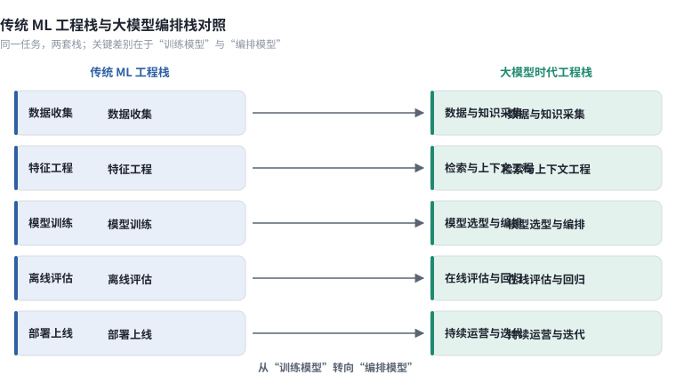
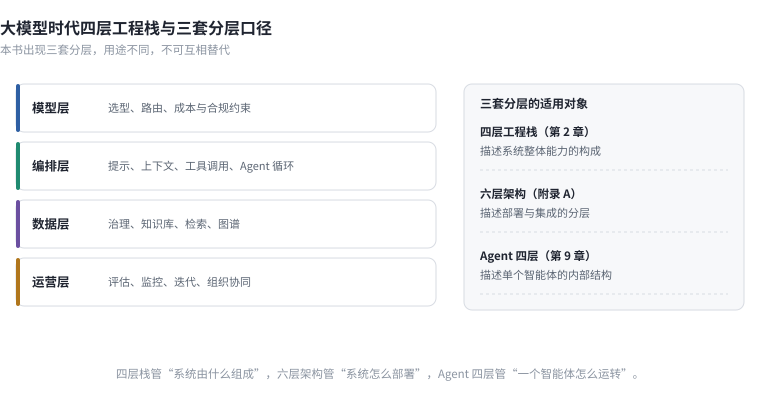

# 第 2 章　从 ML 工程到 AI 工程的范式迁移

**本章速览卡**

| 项目 | 内容 |
|------|------|
| 解决什么问题 | 为什么把一套成熟的 ML 平台原样搬到 LLM 项目上会失灵？新旧两套工程栈的差别究竟落在哪一层？ |
| 读完得到什么 | ① 一张传统 ML 栈与大模型编排栈的逐列对照表；② 大模型时代四层工程栈（模型层／编排层／数据层／运营层）；③ 一张三套分层口径对照表，避免全书概念混淆；④ 一条"工程能力决定效果上限"的判断依据 |
| 前置章节 | 第 1 章。跳读不影响本章，但 1.3 节的失败归因结构会在本章反复引用 |
| 数据快照 | 2026-09 |

---

2025 年夏天，一家股份制银行的算法团队接手了行内的第一个大模型项目：给信贷经理做一个尽调材料助手，把企业授信材料里的财务、股权、诉讼信息抽出来，生成一页摘要。

团队不缺经验。他们运营着一套跑了六年的 ML 平台：特征仓库里有几百个加工好的特征，训练流水线每周自动跑批，模型上线走标准化的灰度流程，监控看板上有 AUC 和 KS 的实时曲线。按过去的做法，接一个新需求无非是标注数据、训练、评估、上线。

他们照同样的路径排了计划，然后卡住了。

第一处卡点在训练环节。传统的信贷风险模型有明确标签——过去三年哪些客户违约，数据团队早就沉淀好了。而"尽调摘要写得好不好"没有标签。团队花了三周定义标注规范，最后发现连业务专家之间对"好摘要"的理解都不一致：风控出身的人关心风险揭示，客户经理关心信息密度，合规岗只关心有没有漏掉诉讼。

第二处卡点在部署环节。风险模型是一进一出的结构化预测，接口稳定、输入可控、延迟以毫秒计。而摘要助手是一条串联了文档解析、检索、生成、格式校验的多组件链路，输入是一份份排版各异的 PDF，输出是自由文本，单次调用要几秒到十几秒，成本按 Token 计。原有的监控看板无法回答"这个系统今天表现如何"。

第三处卡点最出乎意料。平台里最值钱的东西——特征仓库、训练流程、模型仓库——在这个项目里几乎用不上。真正决定效果的是另外三件事：PDF 解析的质量、检索到的材料片段是否完整、生成时的提示词有没有把口径约束住。这三件事在过去六年的平台建设里，一件都没覆盖。

项目最终的交付方式，是团队临时搭了一套脚本加定时任务的流水线，和那套 ML 平台基本没有复用关系。负责人复盘时说了句实在话：我们不是在用 AI，是在给 AI 打下手。

这个项目说明的问题，就是本章要展开的：**大模型时代，工程栈的重心发生了迁移。**传统 ML 工程把主要精力放在"怎么把模型训好"，LLM 应用把主要精力放在"怎么把模型编排好、把数据喂对、把运营接住"。旧栈的能力依然有用，但它只覆盖了新问题的一部分。

## 2.1 传统 ML 工程栈回顾

传统 ML 工程栈在过去十年里已经相当成熟。它以"训练一个专用模型"为中心，五个环节环环相扣，每个环节都有清晰的标准动作和验收口径。下表把它的环节、交付物和隐含前提压成一张对照，供后文与编排栈逐列比较。

**表 2-1　传统 ML 工程栈的五个环节**

| 环节 | 核心动作 | 交付物 | 隐含前提 |
|------|---------|--------|---------|
| 数据收集 | 采集历史样本、定义标签、划分训练／验证／测试集 | 带标签数据集 | 标签可得、样本分布稳定 |
| 特征工程 | 清洗、归一化、构造特征、落特征仓库 | 特征表与特征服务 | 特征可预先穷举并固化 |
| 训练 | 选算法、调参、交叉验证、版本管理 | 模型权重 | 训练是离线批处理、可复现 |
| 评估 | 离线指标（AUC／F1／RMSE）、回测 | 评估报告 | 离线指标与业务目标一致 |
| 部署 | 打包、灰度、A/B、监控、回滚 | 在线推理服务 | 输入可控、接口稳定、延迟低 |

这张栈的适用边界很清楚：**任务边界固定、标签可得、输入结构化、指标可离线复现**。信贷评分、推荐排序、点击率预估、销量预测都落在边界之内。四项前提任意一项不成立，栈的效力就迅速衰减。失效最典型的三类场景是：任务本身没有稳定标签（"写得好不好"）、输出来自开放世界（用户提问的分布无法穷举）、系统的核心价值不来自你训的模型（检索、解析、编排的质量）。

值得留意的是这三类失效的共同点：它们都发生在"数据侧"而不是"模型侧"。第一类缺的是标签数据，第二类缺的是对真实分布的掌握，第三类缺的是可检索、可复用的知识。模型换得再勤，这三件事一个都不会自动解决。这也是本章后续讨论的起点。



> 图 2-1　左列是传统 ML 栈的五个环节，右列是大模型编排栈的四层。两条竖线的错位处，就是本章讨论的重心迁移：训练让位于编排，离线评估让位于持续运营。

## 2.2 大模型时代的工程栈变化

如果说传统 ML 栈的起点是"我有一批数据，要训一个模型"，大模型时代的起点变成了"我有一批模型，要组一个系统"。团队的核心工作从训练模型，转向编排模型。

变化的根源是模型的供给方式变了。能力以 API 或开源权重的形式随时可换，同一档能力的获取成本大约每 12 到 18 个月下降一个数量级（见第 1 章）。一天之内就能换掉底座模型，却换不掉你的数据管线和知识底座。差异化从"训出别人训不出的模型"，转移到了工程侧。

新的工程栈可以拆成四层。

**表 2-2　大模型时代四层工程栈**

| 层 | 解决什么 | 典型组成 | 团队常犯的错 |
|----|---------|---------|------------|
| 模型层 | 提供基础能力 | 闭源 API、开源权重、私有化部署、多模型路由 | 把选型当一次性决定，不做持续评测 |
| 编排层 | 把能力组装成任务 | 提示与上下文工程、检索编排、工具调用、Agent 循环、评估集与回归 | 用提示词硬编码业务逻辑，不做版本管理 |
| 数据层 | 提供可靠输入 | 数据接入、清洗、分块、指标口径、知识库、权限 | 沿用数仓思维，忽略语义与知识 |
| 运营层 | 让系统持续可用 | 监控、成本、灰度、反馈闭环、迭代节奏 | 上线即结束，没有运营责任人 |

四层的顺序是一条从能力供给到持续运营的链路：模型层给出原始能力，编排层把它组装成任务，数据层决定喂进去的东西对不对，运营层保证它在真实环境里活得下去。任何一层缺失，系统都会在某个看不见的地方失效。

四层之间还有两个不直观的性质，值得先说清楚。

一是**可替换性不对称**。模型层是全栈里最容易替换的一层，换一个 API 只需改几行配置；数据层是最难替换的一层，指标口径、知识库、权限体系沉淀下来往往要几个月到几年。团队的资源应该按这个不对称来分配，把稳定性压在下方，把灵活性留在上方。

二是**失效会向上传导**。数据层的一个口径错误，会在编排层被检索到、被模型引用、被生成放大，最后在运营层以"准确率下降"的形式暴露出来。看到现象在运营层，根因常常在数据层。这就是第 1 章归因结构里"数据层问题修复周期最长"的原因（详见第 3 章）。

这里必须一次性讲清一个容易混淆的问题。本书在不同章节会出现三套分层，它们分的不是同一件东西。读者在后文遇到"四层""六层""Agent 四层"的说法时，回到下表即可对上。

**表 2-3　本书三套分层口径对照**

| 分层体系 | 出现位置 | 分的是什么 | 层数 | 用来回答什么 | 不要用它回答什么 |
|---------|---------|-----------|------|------------|---------------|
| 四层工程栈 | 本章 2.2 | 一个 AI 系统的工程构成 | 4 | 我的系统与团队缺哪一层 | 企业数据本身的成熟度 |
| 六层架构 | 附录 A | 企业级 AI 平台的技术架构 | 6 | 平台要建哪些组件、如何分层部署 | 单个项目的团队分工 |
| Agent 四层 | 第 9 章 | 单个智能体的内部结构 | 4 | Agent 的规划／执行／观察／反馈怎么拆 | 数据治理进行到哪一步 |

三套分层只在各自的适用对象内成立。把它们混用，讨论会很快失焦——比如拿"Agent 四层"去评估一家企业的数据治理水平，或者在平台组件清单里找"规划层"，都会得出错误结论。

同一任务在两套栈里的差别，可以用一份配置看出来。传统 ML 的交付物是一份训练脚本，编排栈的交付物是一份把模型、检索、工具串起来的声明：

```yaml
# 编排栈的最小声明：四层各出现一次
model:
  primary: <模型标识>            # 模型层：可随时替换
  fallback: <模型标识>
orchestration:
  steps:
    - retrieve: {source: <知识库>, top_k: 8}     # 编排层：检索
    - rerank: {top_n: 3}
    - generate: {prompt: <提示模板>, max_tokens: 800}
    - validate: {schema: <输出结构>}              # 结构化校验
data:
  index: <向量索引>              # 数据层
  permission: <租户与权限域>
ops:
  eval_set: <回归评估集>          # 运营层：改动必须过回归
  monitor: [latency, cost, abstain_rate]
```

> 关键决策点在于：这份配置里没有"训练"这一栏。团队的资产从权重变成了配置、数据与评估集——这也解释了 2.1 节那张表为什么在 LLM 项目里大面积失效。



> 图 2-2　上半部分是本章的四层工程栈，下半部分并列本书的三套分层口径。读者若在后文遇到三种"层"的说法，回到这张图即可区分各自在描述什么。

## 2.3 工程能力成为分水岭

既然模型可以随时替换，那什么决定系统的最终表现？本书的观察是：在同等模型条件下，工程能力的差异会带来**常见 20–40 个百分点的效果差距**。［D｜本书项目复盘，样本 N=…］

这个区间的含义要说清楚。它不是说"工程做得好就能把 60 分做到 95 分"，而是同一批模型、同一批数据下，不同团队交付的系统在业务验收口径上的差距。区间之所以宽，是因为它高度依赖任务类型：知识密集型问答的差距往往落在区间上沿，而结构化抽取这类有客观判据的任务，差距会小一些。

差距来自哪里？回到第 1 章的归因结构，来自模型层之外的那些部分。同一份模型 API，配不同的检索策略、不同的分块方式、不同的兜底机制，最终效果会差出一大截。第 1 章那个 RAG 案例里，团队换了四种方案仍卡在门槛之下，问题始终不在模型，而在评估集缺失——每一轮优化都无法归因，只能凭体感判断。

把"工程能力"这个词拆开，它至少包含三样可观察、可训练的东西。第一样是**可测量的能力**：能不能为一个模糊的业务需求定义出可验收的效果指标，并在开工前建立评估集。第二样是**可复用的能力**：每一次失败是否沉淀成了测试用例、配置模板或检查清单，而不是留在某个人的记忆里。第三样是**可回滚的能力**：每一次改动是否可追溯、可对比、可撤回，出问题多久能定位到具体哪一次变更。

三样能力都不依赖更强的模型，却直接决定效果。这也解释了第 1 章那组对照——外部合作方主导的项目成功率约 67%，企业完全自建约 33%［A｜MIT NANDA，2025-07］。差距很大一部分来自经验密度：踩过坑的团队知道评估集要先建、知道兜底判据要设在哪、知道哪一层最容易被忽略。

两段代码能把这件事讲具体。它们用的是同一个模型，差别全在工程：

```python
# 实现 A：调用栈——把问题直接丢给模型
answer = llm(question)

# 实现 B：编排栈——多组件、可评估、有兜底
docs = hybrid_retrieve(question, k=8)          # 三路检索
docs = rerank(docs, top_n=3)                   # 重排
if max_relevance(docs) < 0.5:                  # 兜底判据
    return "未找到相关信息，请补充条件"
answer = llm(build_prompt(question, docs))     # 生成
answer = enforce_schema(answer)                # 结构化校验并附带口径说明
```

> 关键决策点：是否有检索、是否做重排、是否设兜底阈值、是否做结构化校验——这些决定都不在模型里。20–40 个百分点的差距，主要产生在这一段。

由此得到贯穿全书的第二句判断：**BI 是根基，AI 是引擎，数据治理能力决定 AI 的上限。**一个 BI 做不出来的指标，AI 也答不对；一个在业务里有两套定义的"收入"，换成任何模型都是两套答案。模型越强，这条规律越显眼——因为强模型会把你喂给它的错误数据，用更流畅、更自信的方式讲出来。这也正是本书从数据治理而非模型工程讲起的原因。

## 2.4 本书的技术路线图

本节只做导览，架构细节留在各自章节。把全书 16 章放回四层工程栈，阅读路径就清楚了。

**数据层**是篇幅最重的一篇，对应第 3 到第 8 章：数据治理的新旧之辨（第 3 章）、知识资产建设（第 4 章）、RAG 工程化（第 5 章）、LLM Wiki 与知识沉淀（第 6 章）、本体驱动（第 7 章）、GraphRAG 与混合知识架构（第 8 章）。它是决定上限的一层，也是本书与同类书差异最大的一段。

**模型层**主要落在第 9 章 9.4 节与第 13 章：选型、评估、路由、部署模式、国产算力适配。

**编排层**对应第 9 到第 11 章：Agent 架构设计（第 9 章）、多 Agent 协作与编排（第 10 章）、超级智能体的目标态与现阶段工程组合（第 11 章）。

**运营层**对应第 12、13 章：FDE 角色与场景诊断（第 12 章）、部署架构与持续运营（第 13 章）。

第 14 到第 16 章是三套完整落地案例（政务、金融、智能制造），结语给出六个可证伪的趋势判断。前置的阅读指南与附录 A 给出全书地图与六层架构的完整定义。

需要说明本书为什么把最重的篇幅给了数据层。按表 2-2，四层里任何一层出问题系统都会失效，但四层的投入回报并不均等。模型层可以买、可以换；运营层是一套流程，方法论一旦成型迁移成本不高；编排层的模式在近两年已经高度收敛，公开的最佳实践足够参考。唯独数据层，每一家企业的指标口径、业务对象、权限规则都不同，买不来也抄不走。把它做扎实，是少数几个能形成长期壁垒的工程投入。

一个具体的对照可以帮助理解这条路线图的现实含义。同样做一个"经营问数"系统，只做编排层的团队大概能在几周内做出一个演示，但一旦业务问出"这个数字按哪个口径算的"，系统就答不上来；把数据层做扎实的团队，交付会慢一些，但每个回答都能给出指标定义、数据来源和口径说明。前者是 Demo，后者才是生产系统。第 3 章就从数据层开始。

对读者而言，这条路线图可以简化成三条线：关心"系统算得对不对"的，走数据与知识线（第 3–8 章）；关心"系统能不能自己跑起来"的，走智能体线（第 9–11 章）；关心"系统能不能被业务接住"的，走交付线（第 12–13 章）。三条线在第 11 章与第 13 章交汇，那里也是全书从"建系统"转向"交结果"的转折点。

## 常见坑

**症状**：把公司成熟的 ML 平台直接拿来承接第一个 LLM 项目，三个月后发现复用度接近零。
**根因**：ML 平台围绕"训练专用模型"建设，而 LLM 项目的价值集中在解析、检索、编排、运营，恰好是平台没覆盖的部分。
**对策**：先按表 2-2 给项目做一次四层落点评估，标出平台已经覆盖的层和完全空白的层，再决定是扩平台还是另起。

**症状**：团队把大部分精力花在模型选型上，反复横跳，效果却没有明显变化。
**根因**：把模型层当成差异化的来源。同等模型条件下，差距主要在编排层与数据层。
**对策**：冻结一轮模型选型，把资源移到检索策略、分块方式、兜底机制与评估集建设上，用同一评估集比较改动前后的效果。

**症状**：讨论会上各说各的"层"——有人说四层缺运营，有人说六层要补组件，会议无法收敛。
**根因**：三套分层口径被混用。四层工程栈、六层架构（附录 A）、Agent 四层（第 9 章）描述的是不同对象。
**对策**：开会前先对齐"我们现在讨论的是哪套分层"，参照表 2-3 划定本次讨论的范围。

**症状**：系统上线后没人负责，效果逐月下滑而无人察觉。
**根因**：运营层缺失。团队按传统软件的"上线即交付"节奏工作，而 AI 系统需要持续运营。
**对策**：给系统指定明确的运营责任人，建立双周或月度的评估、分析、优化、回归节奏（详见第 13 章）。

## 可执行清单

- [ ] 画出你当前系统在四层工程栈上的落点，标出投入最少的那一层
- [ ] 清点系统里"可随时替换的模型"与"不可替换的资产（数据、配置、评估集）"各占多少
- [ ] 检查数据层是否只覆盖了结构化数据，缺语义与知识
- [ ] 确认编排层是否纳入版本管理：提示词、检索配置、工具定义是否都进版本库
- [ ] 统计最近三次模型替换后效果的真实变化，验证"工程决定上限"是否成立
- [ ] 确认系统有一个独立于训练数据的评估集，且最近一次改动做过回归
- [ ] 给系统指定一名运营责任人，写进项目文档
- [ ] 按表 2-3 把团队内部常用的"层"的说法统一一遍，消除歧义

## 延伸阅读

1. Chip Huyen. *AI Engineering*. O'Reilly，2025. 从模型工程栈视角切入 AI 工程，可作本章的对照读物，重点看其评估与部署部分。
2. Anthropic. *Building Effective Agents*. 2024-12. 官方博客，给出 workflow 模式的分类，是编排层设计的直接参考。
3. 本书第 5 章与附录 A，分别展开编排层的检索工程与六层平台架构的完整定义。
4. 本书配套仓库 `ch02/`：同一任务在传统 ML 栈与大模型编排栈下的最小对比实现。
5. 本书配套在线数据快照表：本章数字的逐条来源与更新记录。

## 数据快照

| 数据点 | 数值 | 来源 | 快照日期 |
|--------|------|------|---------|
| 同档模型能力的成本下降周期 | 约每 12–18 个月下降一个数量级 | 本书归纳，见第 1 章 | 2026-09 |
| 同等模型下工程能力导致的效果差距 | 常见 20–40 个百分点 | ［D｜本书项目复盘，样本 N=…］ | 2026-09 |
| 传统 ML 栈适用前提 | 4 项（固定边界／标签可得／输入结构化／指标可复现） | 本书归纳 | 2026-09 |
| 大模型时代工程栈层数 | 4 层 | 本书归纳 | 2026-09 |
| 本书并列使用的分层口径 | 3 套 | 本书归纳 | 2026-09 |

> 本章数字均在配套仓库 `data-snapshots/ch02.md` 中留有逐条说明，按季度校准。
